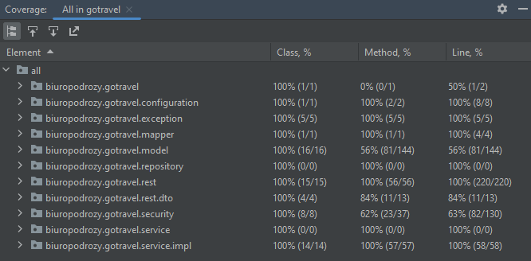

# GoTravel
> Aplikacja webowa obsługująca klienta biura podróży.

## Spis treści
* [Cel projektu](#cel-projektu)
* [Technologia](#technologia)
* [Funkcjonalności](#funkcjonalności)
* [Bezpieczeństwo](#bezpieczeństwo)
* [Testy jednostkowe](#testy-jednostkowe)
* [Screenshots](#screenshots)
* [Endpointy](#endpointy)

## Cel projektu
Celem projektu jest stworzenie aplikacji webowej z interfejsem graficznym, która będzie obsługiwać interakcje z użytkownikiem i komunikować się z serwerem REST w celu pobierania i przetwarzania danych. Aplikacja jest przeznaczona dla klientów biura podróży do przeglądania i rezerwowania ofert wycieczek.

## Technologia
Backend
- Java 17
- Spring Boot 3.0.5
- Baza danych MySql

Frontend
- React.js 18.2.0

## Funkcjonalności
Funkcjonalności zostały podzielone dla dwóch typów klientów: niezalogowanych oraz zalogowanych.

Funkcjonalności dla klienta niezalogowanego:
- Założenie nowego konta;
- Zalogowanie się;
- Przeglądanie ofert wycieczek (z podziałem na kategorie takie jak: last minute, promocje, egzotyka, długi pobyt, rejsy, krótki urlop, all inclusive, wakacje z dziećmi.
- Wyszukiwanie ofert (po polach takich jak państwo, długość trwania wyjazdu, rodzaj transportu);
- Filtrowanie ofert (po polach takich jak rodzaj transportu, ilość dni, kraj oraz przedział cenowy);

Funkcjonalności dla klienta zalogowanego:
- Przeglądanie ofert wycieczek (z podziałem na kategorie takie jak: last minute, promocje, egzotyka, długi pobyt, rejsy, krótki urlop, all inclusive, wakacje z dziećmi.
- Wyszukiwanie ofert (po polach takich jak państwo, długość trwania wyjazdu, rodzaj transportu);
- Filtrowanie ofert (po polach takich jak rodzaj transportu, ilość dni, kraj oraz przedział cenowy);
- Rezerwacja wycieczki;
- Generowanie własnej wycieczki (wybór miejsca, zakwaterowania, atrakcji, itp.);
- Dodanie/usuwanie opinii do wycieczki;
- Usunięcie rezerwacji;
- Edycja danych użytkownika, zmiana hasła, usunięcie konta;
- Włączenie/wyłączenie logowania dwufazowego;

## Bezpieczeństwo
Zostały wykorzystane tokeny JWT, których ważność wygasa po określonym czasie. W kontekście uwierzytelniania i autoryzacji, JWT pozwala na bezpieczne przechowywanie informacji o użytkowniku, które można następnie wykorzystać do weryfikacji tożsamości oraz udzielania dostępu do zasobów. 
Hasła do kont użytkowników są szyfrowane i zapisane do bazy danych jako tekst niejawny. Jako koder został wykorzystany BCryptPsswordEncoder. 
Logowanie dwufazowe wykorzystuje algorytm TOTP (Time-Based One-Time Password). TOTP to algorytm generowania jednorazowych haseł (OTP), które są ważne przez krótki okres czasu, 30 sekund. TOTP jest oparty na algorytmie HMAC-Based One-Time Password (HOTP) i jest szeroko stosowany w takich usługach, jak Google Authenticator, Microsoft Authenticator czy Authy.
Aplikcja została zabezpieczona przed atakami:
- XSS
- SQL Injection
- CSRF

## Testy jednostkowe
Aplikacja została przetestowana pod kątem jakości i poprawności kodu z wykorzystaniem JUnit 5 i Mockito. Pokrycie testowe wyniosło 80% wszystkich linii kodu.

## Screenshots
Widok strony głównej aplikacji widoczny dla użytkownika niezalogowanego

Formularz rejestracji

Formularz logowania

Wprowadzenie kodu autentykacyjny

Wyświetlenie ofert wycieczek z kategorii last minute 

Szczegóły wycieczki

Rezerwacja wycieczki

Wyświetlenie rezerwacji

Edycja danych

Kreator wycieczek

Endpointy
https://documenter.getpostman.com/view/21395963/2s93z6cPAm
